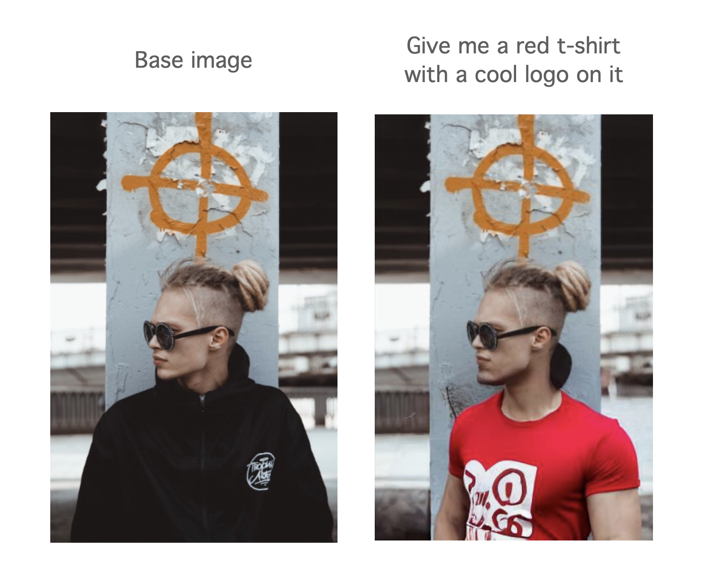

# prompted-inpainting-backend

This is a hobby project which explores text based image editing for altering clothing items by simply describing what changes a user would like e.g. "Give me a red t-shirt with a cool space theme image on it". There is no need to manually annotate or draw bounding boxes to allow the image editing to work.

To use the backend server a stable diffusion 2 inference endpoint must be set up via huggingface. See `Ml endpoint deployment`

Example inputs/outputs are shown below demonstrating the capability of the tool:




Note that this project is based off of the fastAPI cookie cutter repo found [here](https://github.com/tiangolo/full-stack-fastapi-postgresql) with the additional generative AI/ image processing modules appended as additional components.

## ML endpoint deployment

- the Stable diffusion 2 model is used out of the box via the hugginface inference endpoints service (using the below repo):
  - https://huggingface.co/philschmid/stable-diffusion-2-inpainting-endpoint

## Setup

- ensure to set up the environment variables files for both dev and prod usage by running the below

```console
cd app
./generate_env_files.sh
```

- fill in the files with the appropriate values
- Note that the prod env file has been made to be in json format, this is obviously non-ideal but it is the format required for the prod AWS lambda function to be tested on a local machine before deployment to AWS - [more info here on this limitation](https://docs.aws.amazon.com/serverless-application-model/latest/developerguide/serverless-sam-cli-using-invoke.html#serverless-sam-cli-using-invoke-environment-file)

## Running using docker (dev)

- run `docker build -f backend_dev.dockerfile -t inpainting-backend .` while in the `app/` directory to build the project backend docker image
- run `docker compose up` to start up the backend service for debugging
- interact with the backend server by navigating to: http://localhost:8000/docs
- service urls:

Automatic interactive documentation with Swagger UI (from the OpenAPI backend): http://localhost:8000/docs

Alternative automatic documentation with ReDoc (from the OpenAPI backend): http://localhost:8000/redoc

PGAdmin, PostgreSQL web administration: http://localhost:5050

- to attach to the running container for debugging purposes
    - run `docker compose up -d` to start the container in detached mode
    - run `docker exec -it prompted-inpainting-backend-backend-1 bash` to start a bash session

## Production deployment (prod)

Note that the AWS lambda production deployment involves a custom docker image (based off of a AWS lambda python image). This makes it
more convenient to install custom libraries/packages but has the downside of needing aws ECR for image storage. The built image is also
constrained to running the aws lambda handler comand instead of the default uvicorn server command. From the root of the project:

- run `sam validate` to validate the AWS SAM template file
- run `sam build` to build the AWS lambda image based function
- run `sam local start-api --debug --host 127.0.0.8 --port 8000 --env-vars app/prod_env.json` to run the AWS lambda function locally before pushing to production
- run `sam deploy --guided` to perform a guided deployment of the build (with the build command being performed first - exclude `--guided` to perform without prompts)

## Project - lessons learnt

- AWS SAM can build a serverless lambda function using a zip file or docker image -> a custom docker image allows more flexibility in installing 3rd party libraries in a known environment (e.g. benefit of using docker)
  - ensure to have the correct function handler path into the docker image (i.e. ensure to mount correct path)
  - always run the local debug api start before deploying the lambda function to ensure correct operation
- AWS gateway API needs CORS enabled if resource access from frontend/service that is hosted from another origin
  - ensure to enable the correct domain names in the allowed CORS values of the relevant backend (in this case python fastAPI)

This project has the capability to set up user accounts with a postgres database, if this code is reactivated the steps for deploying to an AWS RDS postgres instance with alembic based migrations are mentioned below.

## Production database (via AWS RDS)

- To set up a production database use AWS RDS to create a postgres database.
  - Ensure to set public accessibility to True in AWS so that alembic migrations can be run from local PC
  - Ensure to have the database VPC security group enabling access from the local PC running the migrations (should turn off once migrations are complete)
  - Ensure to have any aws services (e.g. aws lambda functions) able to access the database in its VPC group
- When running alembic migrations, it seems easier to have separate env files for dev/prod to switch between the two databases to migrate changes into production

## Database migrations

- initialising a database migration with alembic (from within the `app/` directory)
  - `alembic init alembic`
- ensure to run the remaining alembic commands inside the dev backend container while the service stack is running (this is to enable connection to the dev db)

```console
$ docker compose exec backend bash
```

- After changing a model (for example, adding a column), create a revision, e.g.:

```console
$ ENV_PATH=./dev.env alembic revision --autogenerate -m "Add column last_name to User model"
```
- When running the above revision command, apply a path to the env file to be used (dev or production db for examples):
```console
$ ENV_PATH=./dev.env alembic revision --autogenerate -m "Initial set up"
```
For production change `ENV_PATH` as below:
```console
$ ENV_PATH=./prod_env.json alembic revision --autogenerate -m "Initial set up"
```


- Commit to the git repository the files generated in the alembic directory.

- After creating the revision, run the migration in the database (this is what will actually change the database):

```console
$ ENV_PATH=./dev.env alembic upgrade head
```